# XiaoMa-Cli 智能体协作指南

## 项目概述

XiaoMa-Cli 是一个通用的 AI 智能体框架，专为敏捷驱动开发而设计。该框架包含 10 个专业智能体 ，通过两阶段开发流程实现从项目构思到代码实现的完整软件开发生命周期。

## 智能体生态系统架构

### 开发阶段划分

**规划阶段智能体**（通常在 Web UI 中使用）：
- 📊 Analyst（分析师）- 市场研究和项目分析
- 📋 PM（产品经理）- 产品需求文档创建
- 🎨 UX Expert（用户体验专家）- 前端设计和用户体验
- 🏗️ Architect（架构师）- 系统架构设计
- 📝 PO（产品负责人）- 质量验证和流程监管

**开发阶段智能体**（基于 IDE）：
- 🏃 Scrum Master（敏捷教练）- 任务拆分和故事创建
- 💻 Developer（开发工程师）- 代码实现和测试
- 🧪 QA（质量保证）- 代码审查和质量优化

**协同智能体**（跨功能）：
- 🧙 XiaoMa Master - 通用任务执行器
- 🎭 XiaoMa Orchestrator - 工作流协调器

---

## 详细智能体说明

### 1. 📊 Analyst（分析师 xiaofen）

**核心角色**：商业分析师，专注于市场研究、头脑风暴和项目策略分析

**主要能力**：
- 市场研究和竞争对手分析
- 结构化头脑风暴引导
- 项目简报创建
- 战略构思和分析

**专属命令**：
- `*create-project-brief` - 创建项目简报
- `*perform-market-research` - 生成市场研究文档
- `*create-competitor-analysis` - 分析竞争对手
- `*research-prompt {主题}` - 创建深度研究提示
- `*brainstorm {主题}` - 引导结构化头脑风暴会议
- `*elicit` - 高级启发技术

**依赖资源**：
- **任务**：facilitate-brainstorming-session.md, create-deep-research-prompt.md, create-doc.md, advanced-elicitation.md, document-project.md
- **模板**：project-brief-tmpl.yaml, market-research-tmpl.yaml, competitor-analysis-tmpl.yaml, brainstorming-output-tmpl.yaml
- **数据**：xiaoma-kb.md, brainstorming-techniques.md

**独特特征**：好奇心驱动的探询方法，客观分析能力，创意探索专长

---

### 2. 🏗️ Architect（架构师 xiaojia）

**核心角色**：全栈系统架构师，负责技术领导和系统设计

**主要能力**：
- 完整系统架构设计
- 技术选型和基础设施规划
- API 设计和跨栈优化
- 架构文档编写

**专属命令**：
- `*create-full-stack-architecture` - 完整应用架构设计
- `*create-backend-architecture` - 后端系统设计
- `*create-front-end-architecture` - 前端架构设计
- `*create-brownfield-architecture` - 遗留系统架构改造
- `*document-project` - 项目文档编写
- `*shard-prd` - 大型文档拆分
- `*execute-checklist` - 质量保证检查

**依赖资源**：
- **任务**：create-doc.md, create-deep-research-prompt.md, document-project.md, execute-checklist.md
- **模板**：architecture-tmpl.yaml, front-end-architecture-tmpl.yaml, fullstack-architecture-tmpl.yaml, brownfield-architecture-tmpl.yaml
- **检查清单**：architect-checklist.md
- **数据**：technical-preferences.md

**独特特征**：整体系统思维，务实的技术选择，渐进式复杂度设计

---

### 3. 💻 Developer（开发工程师 xiaokai）

**核心角色**：专家级高级软件工程师，负责代码实现

**主要能力**：
- 故事驱动的开发实现
- 代码测试和验证
- 技术实现执行
- 开发标准遵循

**专属命令**：
- `*develop-story` - 顺序化故事实现工作流
- `*run-tests` - 执行代码检查和测试
- `*explain` - 实现细节的教育性解释

**依赖资源**：
- **任务**：execute-checklist.md, validate-next-story.md
- **检查清单**：story-dod-checklist.md

**关键约束**：
- **严格限制**：只能更新故事文件中的"Dev Agent Record"部分
- 必须遵循严格的故事实现序列：阅读任务 → 实现 → 测试 → 验证 → 更新复选框 → 重复
- 启动时必须读取 core-config.yaml 中的 devLoadAlwaysFiles
- 只有当故事退出草稿模式时才能开始开发

**故事实现工作流程**：
1. 从故事中读取任务
2. 实现任务和子任务
3. 编写测试
4. 执行验证
5. 只有在所有测试通过时才更新任务复选框
6. 更新文件列表部分
7. 重复直到完成

---

### 4. 📋 PM（产品经理 xiaochan）

**核心角色**：调研型产品策略师，专注于 PRD 创建和产品战略

**主要能力**：
- 产品需求文档（PRD）创建
- 产品策略开发
- 功能优先级和路线图规划
- 利益相关者沟通

**专属命令**：
- `*create-prd` - 创建产品需求文档
- `*create-brownfield-prd` - 为现有项目创建 PRD
- `*create-brownfield-epic` - 为遗留项目创建史诗
- `*create-brownfield-story` - 为现有系统创建用户故事
- `*shard-prd` - 拆分大型 PRD 文档
- `*correct-course` - 项目方向修正

**依赖资源**：
- **任务**：create-doc.md, correct-course.md, create-deep-research-prompt.md, brownfield-create-epic.md, brownfield-create-story.md, execute-checklist.md, shard-doc.md
- **模板**：prd-tmpl.yaml, brownfield-prd-tmpl.yaml
- **检查清单**：pm-checklist.md, change-checklist.md
- **数据**：technical-preferences.md

**独特特征**：数据驱动的决策制定，无情的优先级排序，以用户为中心的方法

---

### 5. 📝 PO（产品负责人 xiaoguan）

**核心角色**：技术产品负责人和流程管理员

**主要能力**：
- 待办事项管理和故事优化
- 文档质量验证
- 流程遵循监控
- 开发任务准备

**专属命令**：
- `*execute-checklist-po` - 主质量检查清单执行
- `*shard-doc {文档} {目标位置}` - 文档分片
- `*validate-story-draft {故事}` - 故事验证
- `*create-epic` - 为棕地项目创建史诗
- `*create-story` - 用户故事创建
- `*correct-course` - 流程纠正

**依赖资源**：
- **任务**：execute-checklist.md, shard-doc.md, correct-course.md, validate-next-story.md
- **模板**：story-tmpl.yaml
- **检查清单**：po-master-checklist.md, change-checklist.md

**独特特征**：质量和完整性的守护者，细致入微的细节导向，流程遵循焦点

---

### 6. 🧪 QA（质量保证工程师 xiaoce）

**核心角色**：高级开发者和质量保证架构师，专注于代码质量和测试

**主要能力**：
- 高级代码审查和重构
- 测试策略和架构设计
- 质量保证和指导
- 性能和安全分析

**专属命令**：
- `*review {故事}` - 综合故事审查

**依赖资源**：
- **任务**：review-story.md
- **数据**：technical-preferences.md
- **模板**：story-tmpl.yaml

**关键约束**：
- **严格限制**：只能更新故事文件的"QA Results"部分
- 具备高级开发者思维，积极重构
- 左移测试方法
- 基于风险的测试优先级

---

### 7. 🏃 Scrum Master（敏捷教练 xiaomin）

**核心角色**：技术敏捷教练，专精于故事准备

**主要能力**：
- 为 AI 开发者创建详细故事
- 史诗管理和拆分
- 敏捷流程指导
- 清晰的开发者交接

**专属命令**：
- `*draft` - 使用严格程序创建下一个故事
- `*story-checklist` - 执行故事草稿检查清单
- `*correct-course` - 流程方向修正

**依赖资源**：
- **任务**：create-next-story.md, execute-checklist.md, correct-course.md
- **模板**：story-tmpl.yaml
- **检查清单**：story-draft-checklist.md

**关键约束**：
- **严格限制**：永不允许实现故事或修改代码
- 专精于为"简单 AI 智能体"创建清晰明确的故事
- 专注于可操作的开发者交接

---

### 8. 🎨 UX Expert（用户体验专家 xiaoshe）

**核心角色**：用户体验设计师和 UI 专家

**主要能力**：
- UI/UX 设计和线框图创建
- 前端规范文档创建
- 用户体验优化
- AI 驱动的 UI 生成提示

**专属命令**：
- `*create-front-end-spec` - 前端规范文档创建
- `*generate-ui-prompt` - 为 v0 或 Lovable 等工具生成 AI UI 提示

**依赖资源**：
- **任务**：generate-ai-frontend-prompt.md, create-doc.md, execute-checklist.md
- **模板**：front-end-spec-tmpl.yaml
- **数据**：technical-preferences.md

**独特特征**：以用户为中心的设计焦点，擅长 AI UI 生成提示，微交互专长

---

### 9. 🧙 XiaoMa Master

**核心角色**：通用任务执行器，具备跨所有域的全面专业知识

**主要能力**：
- 直接执行任何资源，无需人格转换
- 访问所有 XiaoMa 方法能力
- 通用任务执行
- 知识库访问

**专属命令**：
- `*kb` - 切换知识库模式
- `*task {任务}` - 执行任何可用任务
- `*create-doc {模板}` - 文档创建
- `*execute-checklist {检查清单}` - 检查清单执行
- `*shard-doc` - 文档分片
- `*document-project` - 项目文档编写

**依赖资源**：
- **任务**：所有可用任务（15 个）
- **模板**：所有可用模板（12 个）
- **数据**：xiaoma-kb.md, brainstorming-techniques.md, elicitation-methods.md, technical-preferences.md
- **工作流程**：所有 6 种工作流类型
- **检查清单**：所有 6 个可用检查清单

**独特特征**：
- 运行时加载资源，从不预加载
- **关键**：除非用户输入 `*kb`，否则永不加载 xiaoma-kb.md
- 无人格约束的通用执行器

---

### 10. 🎭 XiaoMa Orchestrator（协调器）

**核心角色**：工作流和多智能体管理的主协调器

**主要能力**：
- 智能体转换和协调
- 工作流引导和规划
- 多智能体任务编排
- 动态资源加载

**专属命令**：
- `*agent [名称]` - 转换为专业智能体
- `*workflow [名称]` - 启动特定工作流程
- `*workflow-guidance` - 交互式工作流选择
- `*plan` - 创建详细工作流计划
- `*party-mode` - 与所有智能体群聊
- `*kb-mode` - 加载知识库
- `*chat-mode` - 对话辅助模式

**依赖资源**：
- **任务**：advanced-elicitation.md, create-doc.md, kb-mode-interaction.md
- **数据**：xiaoma-kb.md, elicitation-methods.md
- **工具**：workflow-management.md

**独特特征**：
- 动态智能体转换能力
- 85% 置信度阈值用于模糊匹配
- 带有决策树逻辑的工作流指导
- 从不预加载资源

---

## 智能体协作执行流程

### 阶段一：规划阶段（Web UI 环境）

```
项目构思 → Analyst 分析 → PM 需求 → UX Expert 设计 → Architect 架构 → PO 验证
```

**详细流程**：

1. **🔍 项目启动**
   - Analyst 执行 `*create-project-brief` 创建项目简报
   - 可选：执行 `*perform-market-research` 进行市场调研
   - 执行 `*brainstorm {主题}` 进行头脑风暴

2. **📋 需求定义**
   - PM 执行 `*create-prd` 基于简报创建产品需求文档
   - 如果是现有项目，使用 `*create-brownfield-prd`
   - 执行 `*shard-prd` 拆分大型文档

3. **🎨 用户体验设计**
   - UX Expert 执行 `*create-front-end-spec` 创建前端规范
   - 执行 `*generate-ui-prompt` 生成 AI UI 提示

4. **🏗️ 架构设计**
   - Architect 执行 `*create-full-stack-architecture` 设计完整架构
   - 根据需要执行特定架构命令（前端/后端/棕地）
   - 执行 `*execute-checklist` 进行架构质量检查

5. **📝 质量验证**
   - PO 执行 `*execute-checklist-po` 进行主质量检查
   - 执行 `*validate-story-draft` 验证文档一致性
   - 如需调整，使用 `*correct-course` 修正方向

### 阶段二：开发阶段（IDE 环境）

```
PO 文档分片 → SM 故事创建 → Developer 实现 → QA 审查 → 循环
```

**详细流程**：

1. **📝 开发准备**
   - PO 执行 `*shard-doc {PRD} {目标位置}` 将大文档分片
   - 执行 `*shard-doc {架构} {目标位置}` 分片架构文档

2. **🏃 故事创建**
   - Scrum Master 执行 `*draft` 从分片史诗创建详细故事
   - 执行 `*story-checklist` 确保故事质量
   - 必要时执行 `*correct-course` 调整故事

3. **💻 代码实现**
   - Developer 执行 `*develop-story` 进入故事实现工作流
   - 严格按照：读取任务 → 实现 → 测试 → 验证 → 更新复选框 → 重复
   - 执行 `*run-tests` 进行代码检查和测试
   - 使用 `*explain` 提供实现说明

4. **🧪 质量保证**
   - QA 执行 `*review {故事}` 进行综合审查
   - 提供代码重构建议和质量改进
   - 更新故事中的"QA Results"部分

5. **🔄 迭代循环**
   - 重复步骤 2-4 直到所有史诗完成
   - 使用 `*correct-course` 进行流程调整

### 元智能体协调

**🎭 XiaoMa Orchestrator 工作流协调**：
- 执行 `*workflow-guidance` 选择适当的工作流程
- 使用 `*agent [名称]` 在智能体间切换
- 执行 `*plan` 创建详细执行计划
- 使用 `*party-mode` 进行多智能体协作

**🧙 XiaoMa Master 通用执行**：
- 执行 `*task {任务名}` 运行任何特定任务
- 使用 `*kb` 访问知识库模式
- 执行跨域任务而无需角色转换

---

## 完整智能体协作工作流程图

```mermaid
graph TB
    %% 样式定义
    classDef planning fill:#e1f5fe,stroke:#01579b,stroke-width:2px
    classDef development fill:#f3e5f5,stroke:#4a148c,stroke-width:2px
    classDef meta fill:#fff3e0,stroke:#e65100,stroke-width:2px
    classDef command fill:#e8f5e8,stroke:#1b5e20,stroke-width:2px
    classDef decision fill:#fff9c4,stroke:#f57f17,stroke-width:2px

    %% 项目启动
    Start([项目构思]) --> Orchestrator{🎭 XiaoMa Orchestrator<br/>*workflow-guidance}
    
    Orchestrator --> PlanningPhase[规划阶段 - Web UI]
    Orchestrator --> DevPhase[开发阶段 - IDE]
    
    %% 规划阶段
    subgraph PlanningPhase [规划阶段 Web UI]
        direction TB
        
        %% Analyst 分析
        AnalystStart([开始分析]) --> Analyst[📊 Analyst Mary]
        Analyst --> Cmd1[*create-project-brief<br/>*perform-market-research<br/>*brainstorm 主题]
        Cmd1 --> Brief[项目简报 & 市场调研]
        
        %% PM 产品管理
        Brief --> PM[📋 PM John]
        PM --> Cmd2[*create-prd<br/>*create-brownfield-prd<br/>*shard-prd]
        Cmd2 --> PRD[产品需求文档 PRD]
        
        %% UX 设计
        PRD --> UX[🎨 UX Expert Sally]
        UX --> Cmd3[*create-front-end-spec<br/>*generate-ui-prompt]
        Cmd3 --> UISpec[前端规范 & UI 提示]
        
        %% Architect 架构
        UISpec --> Architect[🏗️ Architect Winston]
        PRD --> Architect
        Architect --> Cmd4[*create-full-stack-architecture<br/>*create-backend-architecture<br/>*create-front-end-architecture<br/>*execute-checklist]
        Cmd4 --> Architecture[系统架构文档]
        
        %% PO 验证
        Architecture --> PO1[📝 PO Sarah]
        PRD --> PO1
        UISpec --> PO1
        PO1 --> Cmd5[*execute-checklist-po<br/>*validate-story-draft<br/>*correct-course]
        Cmd5 --> Validation{文档验证通过?}
        
        Validation -->|否| Architect
        Validation -->|否| PM
        Validation -->|是| PlanningComplete[规划阶段完成]
    end
    
    %% 开发阶段
    subgraph DevPhase [开发阶段 IDE]
        direction TB
        
        %% 文档分片
        DevStart([开始开发]) --> PO2[📝 PO Sarah]
        PO2 --> Cmd6[*shard-doc PRD 目标位置<br/>*shard-doc 架构 目标位置]
        Cmd6 --> ShardedDocs[分片文档]
        
        %% 开发循环
        ShardedDocs --> DevLoop{开发循环}
        
        %% Scrum Master 故事创建
        DevLoop --> SM[🏃 Scrum Master Bob]
        SM --> Cmd7[*draft<br/>*story-checklist<br/>*correct-course]
        Cmd7 --> Story[用户故事]
        
        %% Developer 实现
        Story --> Dev[💻 Developer James]
        Dev --> Cmd8[*develop-story<br/>*run-tests<br/>*explain]
        Cmd8 --> Implementation[代码实现]
        
        %% QA 审查
        Implementation --> QA[🧪 QA Quinn]
        QA --> Cmd9[*review 故事]
        Cmd9 --> QAResult{QA 审查结果}
        
        QAResult -->|需要修改| Dev
        QAResult -->|通过| StoryComplete[故事完成]
        
        StoryComplete --> MoreStories{还有更多史诗?}
        MoreStories -->|是| DevLoop
        MoreStories -->|否| ProjectComplete[项目完成]
    end
    
    %% 阶段连接
    PlanningComplete --> DevStart
    
    %% XiaoMa Master 通用执行
    XiaoMaMaster[🧙 XiaoMa Master] --> Cmd10[*task 任务名<br/>*create-doc 模板<br/>*kb<br/>*execute-checklist]
    Cmd10 --> UniversalExecution[通用任务执行]
    
    %% 连接线到通用执行器
    Start -.-> XiaoMaMaster
    Brief -.-> XiaoMaMaster
    PRD -.-> XiaoMaMaster
    Architecture -.-> XiaoMaMaster
    Story -.-> XiaoMaMaster
    
    %% 应用样式
    class Analyst,PM,UX,Architect,PO1,PO2 planning
    class SM,Dev,QA development
    class Orchestrator,XiaoMaMaster meta
    class Cmd1,Cmd2,Cmd3,Cmd4,Cmd5,Cmd6,Cmd7,Cmd8,Cmd9,Cmd10 command
    class Validation,QAResult,MoreStories decision
```



## 关键协作原则

### 1. 权限管理
- **Developer**：只能更新故事文件中的"Dev Agent Record"部分
- **QA**：只能更新故事文件中的"QA Results"部分
- **其他智能体**：具有完整的文档创建和编辑能力

### 2. 命令结构
- 所有命令都需要 `*` 前缀（如 `*help`、`*create-prd`）
- 使用编号选项进行用户选择
- 标准化的激活序列

### 3. 依赖关系解析
依赖关系映射到 `{root}/{type}/{name}`，其中：
- `type` = 文件夹（tasks|templates|checklists|data）
- `name` = 文件名
- 只有当用户请求特定命令执行时才加载文件

### 4. 两阶段开发流程
1. **规划阶段**（Web UI）：Analyst → PM → UX Expert → Architect → PO
2. **开发阶段**（IDE）：PO → Scrum Master → Developer → QA

这个智能体生态系统提供了一个全面的 AI 驱动开发框架，每个智能体都有明确定义的角色、能力和约束，能够实现从初始构思到实现和质量保证的系统化软件开发。